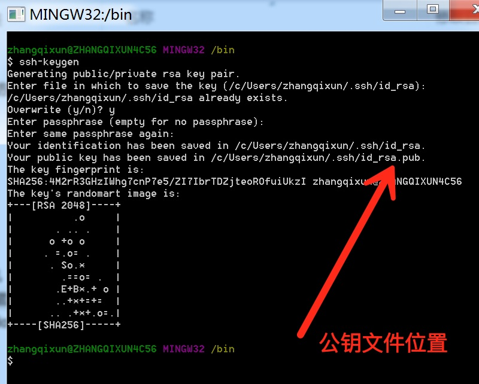
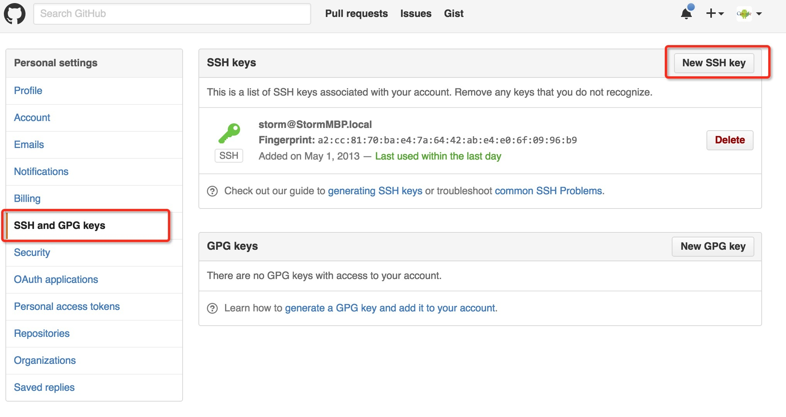
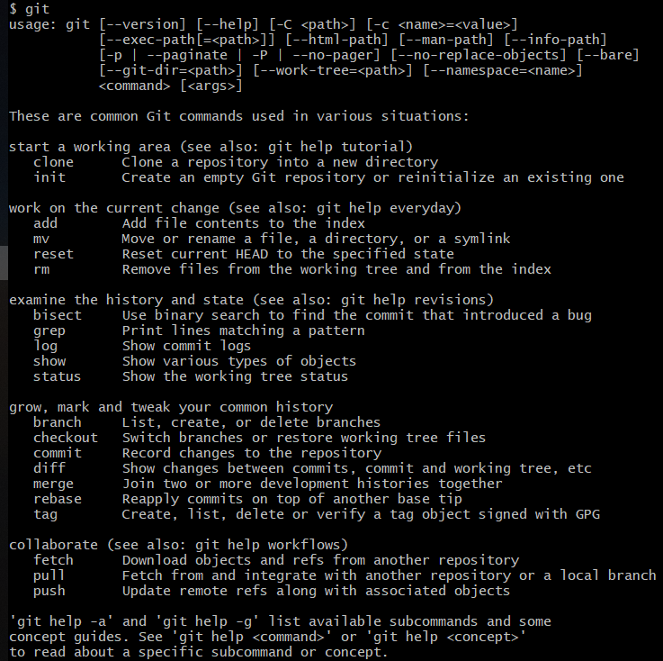

# git 备忘录

## 配置SSH

### 1. 生成公钥

安装完 git 后，右键打开 git bash，在命令行中输入`ssh-keygen`，然后一路回车，用户目录下的 “.ssh” 目录下就会生成两个文件 id_rsa 和 id_rsa.pub ，id_rsa 是密钥，id_rsa.pub 就是公钥。



### 2. 配置 ssh key

用记事本打开 id_rsa.pub，复制里面的全部内容，添加到需要使用的地方。例如在 GitHub 上配置 ssh，则将这些内容添加到 ssh keys 中。




## 初次运行 Git 前的配置

### 1. 用户信息

当安装完 Git 应该做的第一件事就是设置你的用户名称与邮件地址。 这样做很重要，因为每一个 Git 的提交都会使用这些信息，并且它会写入到你的每一次提交中，不可更改：

```console
$ git config --global user.name "John Doe"
$ git config --global user.email johndoe@example.com
```

再次强调，如果使用了 `--global` 选项，那么该命令只需要运行一次，因为之后无论你在该系统上做任何事情， Git 都会使用那些信息。 当你想针对特定项目使用不同的用户名称与邮件地址时，可以在那个项目目录下运行没有 `--global` 选项的命令来配置。

### 2. 检查配置信息

如果想要检查你的配置，可以使用 `git config --list` 命令来列出所有 Git 当时能找到的配置。

```console
$ git config --list
user.name=John Doe
user.email=johndoe@example.com
color.status=auto
color.branch=auto
color.interactive=auto
color.diff=auto
...
```

你可能会看到重复的变量名，因为 Git 会从不同的文件中读取同一个配置（例如：`/etc/gitconfig` 与 `~/.gitconfig`）。 这种情况下，Git 会使用它找到的每一个变量的最后一个配置。

你可以通过输入 `git config <key>`： 来检查 Git 的某一项配置

```console
$ git config user.name
John Doe
```

>Git 自带一个 `git config` 的工具来帮助设置控制 Git 外观和行为的配置变量。 这些变量存储在三个不同的位置：
>1. `/etc/gitconfig` 文件: 包含系统上每一个用户及他们仓库的通用配置。 如果使用带有 `--system` 选项的 `git config` 时，它会从此文件读写配置变量。
>2. `~/.gitconfig` 或 `~/.config/git/config` 文件：只针对当前用户。 可以传递 `--global` 选项让 Git 读写此文件。
>3. 当前使用仓库的 Git 目录中的 `config` 文件（就是 `.git/config`）：针对该仓库。

>每一个级别覆盖上一级别的配置，所以 `.git/config` 的配置变量会覆盖 `/etc/gitconfig` 中的配置变量。
>在 Windows 系统中，Git 会查找 `$HOME` 目录下（一般情况下是 `C:\Users\$USER`）的 `.gitconfig` 文件。 Git 同样也会寻找 `/etc/gitconfig` 文件，但只限于 MSys 的根目录下，即安装 Git 时所选的目标位置。

## git 常用命令



### 1. 获取 Git 仓库

有两种取得 Git 项目仓库的方法。 第一种是在现有项目或目录下导入所有文件到 Git 中； 第二种是从一个服务器克隆一个现有的 Git 仓库。

#### git init 在现有目录中初始化仓库

如果你打算使用 Git 来对现有的项目进行管理，你只需要进入该项目目录并输入：

```console
$ git init
```

该命令将创建一个名为 `.git` 的子目录，这个子目录含有你初始化的 Git 仓库中所有的必须文件，这些文件是 Git 仓库的骨干。 但是，在这个时候，我们仅仅是做了一个初始化的操作，你的项目里的文件还没有被跟踪。 (参见 [Git 内部原理](https://git-scm.com/book/zh/v2/ch00/ch10-git-internals) 来了解更多关于到底 `.git` 文件夹中包含了哪些文件的信息。)

现在，你已经得到了一个实际维护（或者说是跟踪）着若干个文件的 Git 仓库。

#### git clone 克隆现有的仓库

如果你想获得一份已经存在了的 Git 仓库的拷贝，比如说，你想为某个开源项目贡献自己的一份力，这时就要用到 `git clone` 命令。 如果你对其它的 VCS 系统（比如说Subversion）很熟悉，请留心一下你所使用的命令是"clone"而不是"checkout"。 这是 Git 区别于其它版本控制系统的一个重要特性，Git 克隆的是该 Git 仓库服务器上的几乎所有数据，而不是仅仅复制完成你的工作所需要文件。 当你执行 `git clone` 命令的时候，默认配置下远程 Git 仓库中的每一个文件的每一个版本都将被拉取下来。 事实上，如果你的服务器的磁盘坏掉了，你通常可以使用任何一个克隆下来的用户端来重建服务器上的仓库（虽然可能会丢失某些服务器端的挂钩设置，但是所有版本的数据仍在，详见 [在服务器上搭建 Git](https://git-scm.com/book/zh/v2/ch00/r_git_on_the_server) ）。

克隆仓库的命令格式是 `git clone [url]` 。 比如，要克隆 Git 的可链接库 libgit2，可以用下面的命令：

```console
$ git clone https://github.com/libgit2/libgit2
```

这会在当前目录下创建一个名为 “libgit2” 的目录，并在这个目录下初始化一个 `.git` 文件夹，从远程仓库拉取下所有数据放入 `.git` 文件夹，然后从中读取最新版本的文件的拷贝。 如果你进入到这个新建的 `libgit2` 文件夹，你会发现所有的项目文件已经在里面了，准备就绪等待后续的开发和使用。 如果你想在克隆远程仓库的时候，自定义本地仓库的名字，你可以使用如下命令：

```console
$ git clone https://github.com/libgit2/libgit2 mylibgit
```

这将执行与上一个命令相同的操作，不过在本地创建的仓库名字变为 `mylibgit`。

Git 支持多种数据传输协议。 上面的例子使用的是 `https://` 协议，不过你也可以使用 `git://` 协议或者使用 SSH 传输协议，比如 `user@server:path/to/repo.git` 。 [在服务器上搭建 Git](https://git-scm.com/book/zh/v2/ch00/r_git_on_the_server) 将会介绍所有这些协议在服务器端如何配置使用，以及各种方式之间的利弊。